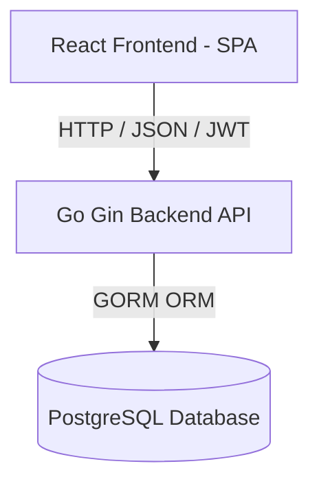

# Online Food Delivery Platform - Project Overview

Welcome to the documentation for the **Online Food Delivery Platform**. This project is a modern, high-performance, full-stack web application designed for food ordering, delivery tracking, and restaurant management.

---

## 🏗️ Architecture & Technology Stack

The application follows a decoupled client-server architecture with a Go-based backend API and a React-based single-page frontend application.



### Backend (Go API)
- **Language**: Go (v1.26+)
- **HTTP Framework**: [Gin Gonic](https://github.com/gin-gonic/gin) (a fast, lightweight web framework)
- **Database Driver & ORM**: [GORM](https://gorm.io/) with the [PostgreSQL driver](https://gorm.io/driver/postgres)
- **Authentication**: JWT (JSON Web Tokens) using [jwt-go/v5](https://github.com/golang-jwt/jwt)
- **Validation**: [validator/v10](https://github.com/go-playground/validator) (integrated in Gin for DTO binding)
- **Password Security**: Bcrypt (`golang.org/x/crypto/bcrypt`) for secure password hashing and verification

### Frontend (React SPA)
- **Language**: JavaScript / JSX
- **Build System & Dev Server**: [Vite](https://vite.dev/) (v8.1.1+)
- **Library**: React (v19.2.7)
- **Routing**: React Router (v7.18.1)
- **State & Data Fetching**: TanStack React Query (v5.101.4)
- **Styling**: Tailwind CSS (v4.3.3) for rapid utility-first styling
- **Form Management**: React Hook Form (v7.83) + Zod (v4.4.3) for runtime schema validation
- **Notifications**: React Hot Toast (v2.6) for user alerts and status updates

---

## 📂 Project Directory Structure

The project is structured logically into two top-level directories: `backend` and `frontend`.

```
onlinefooddelivery/
├── backend/                  # Go Backend Application
│   ├── cmd/
│   │   └── api/
│   │       └── main.go       # Entry point of the Go API server
│   ├── config/
│   │   └── config.go         # Configuration loader & Database initializer
│   ├── database/
│   │   └── migration.go      # Schema Auto-Migration script
│   ├── internal/
│   │   ├── controllers/      # HTTP handlers (Controller layer)
│   │   ├── dto/              # Data Transfer Objects & Request validations
│   │   ├── middleware/       # Auth guard & CORS middlewares
│   │   ├── models/           # GORM schemas (Domain models)
│   │   ├── repositories/     # Database operations (Data access layer)
│   │   ├── routes/           # Router groups and route definitions
│   │   ├── services/         # Business logic layer
│   │   └── utils/            # Helper utilities (Tokens, password hashing)
│   ├── uploads/              # Directory for uploaded food & restaurant images
│   ├── go.mod                # Go module dependencies
│   └── .env                  # Backend environment variables
│
├── frontend/                 # React Frontend Application
│   ├── public/               # Static assets (images, icons)
│   ├── src/
│   │   ├── assets/           # Client-side style resources & static files
│   │   ├── components/       # Shared reusable UI elements (e.g., ProtectedRoute)
│   │   ├── contexts/         # React Contexts (e.g., AuthContext for session management)
│   │   ├── layouts/          # Layout wrapper components (MainLayout, AuthLayout)
│   │   ├── pages/            # View components linked to routing
│   │   ├── services/         # API integration wrapper using Axios
│   │   ├── App.jsx           # App shell with routing configuration
│   │   ├── main.jsx          # Entry point for the frontend SPA
│   │   └── index.css         # Styling system configuration
│   ├── package.json          # Node.js dependencies & scripts
│   ├── vite.config.js        # Vite configuration
│   └── README.md             # Frontend specific guide
│
└── description/              # Documentation Folder
    ├── README.md             # Project overview (this file)
    ├── database_models.md    # GORM Database schemas & relationships
    └── api_documentation.md  # Detailed API endpoints & DTO descriptions
```

---

## 🚀 Setup & Installation Instructions

### Prerequisites
- [Go](https://go.dev/dl/) installed on your machine (v1.26 or later recommended)
- [Node.js](https://nodejs.org/en) installed (v18 or later recommended)
- [PostgreSQL](https://www.postgresql.org/) database server up and running

### Running the Backend

1. **Navigate to the backend folder**:
   ```bash
   cd backend
   ```
2. **Configure Environment Variables**:
   Create a `.env` file in the `backend/` folder (or edit existing variables):
   ```env
   PORT=8080
   DATABASE_URL="host=localhost user=postgres password=postgres dbname=online_food_delivery port=5432 sslmode=disable"
   JWT_SECRET="yoursecretjwtjsonwebtokenkeyhere"
   ```
3. **Run the Database Migrations & Start the Server**:
   The Go program will automatically run schema auto-migrations on startup.
   ```bash
   go run cmd/api/main.go
   ```
   The backend server should start listening on `http://localhost:8080`.

### Running the Frontend

1. **Navigate to the frontend folder**:
   ```bash
   cd frontend
   ```
2. **Install Dependencies**:
   ```bash
   npm install
   ```
3. **Start the Development Server**:
   ```bash
   npm run dev
   ```
   The frontend application will be served at `http://localhost:5173` (or another port outputted in the terminal).
